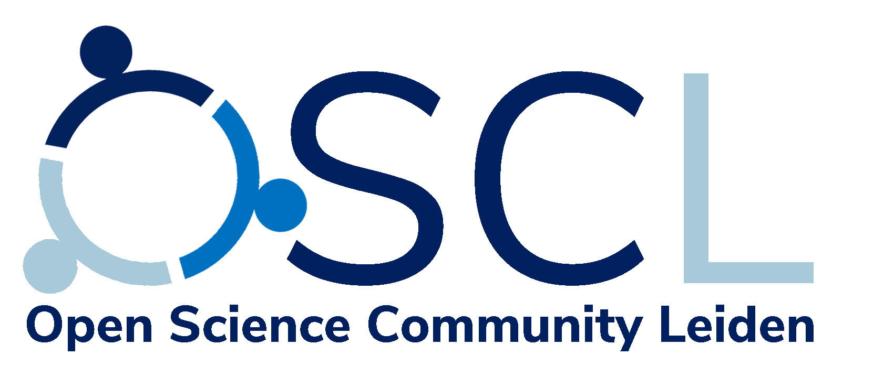

```{r setup, include=FALSE}
options(htmltools.dir.version = FALSE)
library(emo)
```

class: inverse, center, middle

# Open Science

### `r emo::ji("cook")` Open Methods

### `r emo::ji("graph")` Open Data 

### `r emo::ji("unlock")` Open Access 

---
class: center, middle

## Open Methods

How transparent is your research methodology?

Can it be easily reproduced?

Are you using free and open source software?

Is there a detailed record of the steps you took?

---
class: center, middle

## Open Data

Are your data made available according to [FAIR](https://en.wikipedia.org/wiki/FAIR_data) and [CARE](https://www.gida-global.org/care) principals?

<a href="https://www.gida-global.org/care">

</a>

---
class: center, middle

## Open Access

Does everyone have equal access to your work?


--

Institutions from developing countries?

--

Independent scholars?

--

High school teachers?

--

The inquisitive citizen?

---
class: center, middle

<a href="https://www.universiteitleiden.nl/open-science-community-leiden">

</a>

---
class: center, middle

## About us

Safe space for Open Science practitioners of all levels   

from those who want to learn more  
to those who can teach you more

Organise events and workshops on a wide range of topics

Inform Open Science policy from the **bottom up**

--

### Past events

Intro to GitHub

Intro to R Markdown

Formalizing theories

Making your data FAIR

---
class: center, middle

## Join us

https://www.universiteitleiden.nl/open-science-community-leiden/join-us

#### Member profile

<iframe src="./img/oscl-arch.html" width="100%" height="400" style="border:0px #ffffff none;"></iframe>

---
class: center, middle

## Join us

Current [Teams](https://teams.microsoft.com/l/team/19%3a38da1fd582434234b4c014110ccea094%40thread.tacv2/conversations?groupId=97f7ff8d-dce2-4ef8-8f84-f61021f6fc7d&tenantId=ca2a7f76-dbd7-4ec0-9108-6b3d524fb7c8) channels:

.pull-left[

General  
Open Science Coffee Leiden  
Open Science Lunch  
Q and A  
]
.pull-right[
Topics for Talks or Workshops  
Who is who  
OS for mentors and PIs  
ReproducibiliTea Leiden  
]
---
class: center, middle


Seriously, though...

[b.p.bartholdy@arch.leidenuniv.nl](mailto:b.p.bartholdy@arch.leidenuniv.nl)

---
class: center, middle

## Data Carpentries workshop

### R for Social Scientists

Dates: 5-8 July  
Time: 9.00-13.00  
Location: Zoom

https://leidenuniversitylibrary.github.io/2021-07-05-leiden-online/

Feel free to tell your friends, but I would prefer if you tell your students...

PhD students get credits

Master's students get hours
